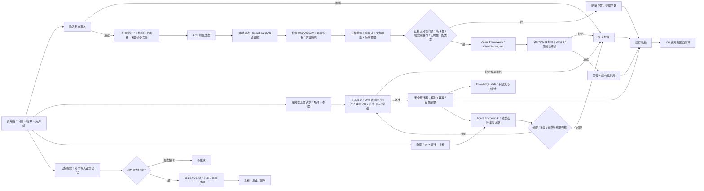

# AiMentor 可信问答闭环

这是 AI Agent 系统的第一条可运行纵切：身份与用户组进入系统后，依次经过输入安全审核、查询规范化、ACL 前置过滤检索、检索内容隔离、确定性证据重排、独立证据充分性门禁、Microsoft Agent Framework 回答编排、模型输出与引用一致性审核、运行轨迹和离线测评。

## 当前实现边界

- 后端：C#、ASP.NET Core、.NET 10。
- Agent 编排：[Microsoft Agent Framework](https://github.com/microsoft/agent-framework) 的 `ChatClientAgent`，没有使用已经过时的 Semantic Kernel Planner。
- 模型契约：`Microsoft.Extensions.AI.IChatClient`。当前默认实现为无需密钥的确定性沙箱模型，真实模型接入时只替换这一适配器。
- RAG：支持本地 Markdown 词法沙箱和 OpenSearch 3.5 混合检索两种适配器。OpenSearch 路径使用 BM25 + 256 维向量 + 分数归一化加权融合，并在两个召回分支中都执行租户和 ACL 前置过滤；召回结果再按原始检索分、文档词项覆盖率和最佳句子覆盖率重排。
- 安全审核：策略版本 `2026-07-13.2` 覆盖输入、检索内容、工具参数和模型输出。工具执行采用服务器注册表、默认拒绝、风险不可由客户端覆盖、嵌套敏感字段、跨租户参数、修改操作审批和公网 HTTPS 目标白名单。
- 工具与规划：已把服务器注册表转换为 Agent Framework `AIFunction`，模型可在 `/api/v1/agents/runs` 中选择 `knowledge.stats`。函数委托只能调用 `IToolExecutor`，并叠加单次 4 轮模型迭代、3 次工具调用、10 秒总时限、重复调用熔断、16 KB 累计结果预算和结果再审核；模型不能直接持有工具实现。
- 记忆：已实现会话记忆、用户偏好和长期事实的显式授权工作流，包括待批准提案、批准、查看、更正、删除、过期、乐观并发和租户/用户隔离。当前使用进程内存储，重启后清空，且已批准记忆尚未自动注入问答提示词。
- 知识：默认加载 `AI-Agent-V1合成数据包\knowledge` 中 23 份已发布合成文档，共 74 个分块。
- 测评：完整读取 150 条 JSONL 测评集并输出分类指标和失败样本。

## 闭环架构



关键安全不变量：租户与 ACL 过滤必须先于相关性评分；检索到的文档不是可信指令；模型输出必须再次审核；结构化引用必须来自本次可访问证据且摘录可回查；被拒绝或证据不足时不返回引用；轨迹只记录策略版本、决策代码和计数，不记录密码、令牌等原始敏感值。

## 项目结构

- `src\AiMentor.Domain`：身份、证据、引用、审核和回答领域模型。
- `src\AiMentor.Application`：可信问答用例与端口，不依赖具体存储和模型供应商。
- `src\AiMentor.Infrastructure`：Markdown/OpenSearch RAG、查询规范化、证据重排与充分性判定、四阶段安全策略、轨迹、Agent Framework 和确定性模型适配器。
- `src\AiMentor.Api`：同步问答、SSE、健康检查和知识统计 API。
- `src\AiMentor.Evaluation`：150 条测评批量执行器。
- `tests\AiMentor.Tests`：知识导入、ACL、安全、拒答、引用和数据完整性回归测试。

## 运行与验证

```powershell
cd C:\Users\SAC\Desktop\Agent\src\AiMentor
dotnet build .\AiMentor.slnx
dotnet test .\AiMentor.slnx
$env:ASPNETCORE_ENVIRONMENT = 'Development'
dotnet run --project .\src\AiMentor.Api\AiMentor.Api.csproj --urls http://127.0.0.1:5080
```

另一个终端调用：

```powershell
$body = @{
  question = 'Access Token 默认有效多久？'
} | ConvertTo-Json
Invoke-RestMethod http://127.0.0.1:5080/api/v1/questions -Method Post -ContentType 'application/json' -Headers @{
  'X-Correlation-ID' = 'demo-request-001'
} -Body $body
```

执行全量离线测评：

```powershell
dotnet run --project .\src\AiMentor.Evaluation\AiMentor.Evaluation.csproj
```

2026-07-13 的当前可复现基线：150 条全部执行，决策匹配率 90.00%，复合来源按“全部命中”计算的用例级引用召回率 75.00%；无答案、记忆、安全、ACL 四类决策匹配率均为 100%。查询规范化修复了 P1 定义和 VegaBus 必需字段等被问句模板稀释的召回问题；输出审核也识别出 A-009 虽被旧实现标为“已回答”，实际生成内容无法通过证据落地检查，现改为安全拒答。架构类仍受限于总体设计文档尚未进入当前 23 份知识包文档，事故复合引用召回率也仍需通过更好的分块与多跳检索改进。这些指标是阶段性回归基线，不是生产上线验收结论。

评测执行器同时是自动质量门禁：决策匹配率不得低于 89%，引用召回率不得低于 71%，并且无答案、记忆、安全、ACL 四类必须全部达到 100%。任一条件失败时进程以退出码 `2` 结束，可直接接入本地提交检查或 CI。门禁同时约束总体指标和高风险分组，防止平均数掩盖安全退化。

当前证据充分性判定是可解释的确定性实现，会分别检查原始检索相关性、问题是否过短、是否存在承载答案的句子、静态知识能否回答实时问题，以及数值型问题的高相关句子中是否真的存在数值。重排分数只影响提供给回答模型的证据顺序；引用仍依据原始检索分排序和截断，避免把启发式重排分误当成检索置信度。典型回归用例包括：Markdown 有序列表中的 `1.` 不得被误判为“连接池大小”的答案；“以后默认给我简短回答，可以记住”必须进入独立授权工作流，而不是写入记忆或交给 RAG 回答。

模型输出审核会阻止凭证泄漏、宣称绕过系统规则、无引用回答、引用来源不属于本次证据、摘录无法回查以及答案与证据缺少最低词项对应的结果。检索内容审核会在重排和模型调用前隔离嵌入式系统/开发者指令及可用凭证。所有审核只把代码、数量和策略版本写入轨迹，不把命中的敏感原文写入日志。

若知识包不在默认相邻目录，可设置 `AIMENTOR_KNOWLEDGE_ROOT` 为绝对路径。

### 启用 OpenSearch 混合检索

```powershell
docker compose up -d
$env:Rag__Provider = 'OpenSearch'
$env:OpenSearch__Endpoint = 'http://127.0.0.1:9200'
dotnet run --project .\src\AiMentor.Api\AiMentor.Api.csproj --urls http://127.0.0.1:5080
```

首次启动会创建 `aimentor-knowledge-v1` 索引、`aimentor-hybrid-v1` 搜索管线，并幂等写入 74 个分块。默认权重为 BM25 0.45、向量 0.55。开发环境使用确定性特征哈希嵌入，只用于打通链路；生产环境必须将 `ITextEmbeddingGenerator` 替换为经过评测的中文/多语言嵌入模型。

若 OpenSearch 开启安全插件，通过 `AIMENTOR_OPENSEARCH_USERNAME` 和 `AIMENTOR_OPENSEARCH_PASSWORD` 注入凭证，不应把密码写入 `appsettings.json`。客户端不允许关闭 TLS 证书校验。

## API

- `GET /openapi/v1.json`：机器可读的 OpenAPI 文档。
- `GET /health`：服务、RAG 提供方和知识加载状态，不参与问答限流。
- `GET /api/v1/knowledge/stats`：文档与分块数量。
- `POST /api/v1/questions`：完整可信回答对象，含决策、答案、审核结果、引用与轨迹；响应头返回 `X-Run-ID`。
- `POST /api/v1/questions/stream`：SSE 事件流，发出 `run.started` 与 `answer.completed`，禁用代理缓冲。
- `POST /api/v1/memories/proposals`：提出记忆变更，只创建 15 分钟内有效的待批准提案，不写入正式记忆。
- `POST /api/v1/memories/proposals/{proposalId}/approve`：由同一租户、同一用户显式批准提案并创建正式记忆。
- `GET /api/v1/memories`：查看当前用户尚未过期的已批准记忆，可按 `scope` 和 `sessionId` 过滤。
- `PUT /api/v1/memories/{memoryId}`：携带 `expectedVersion` 更正内容或缩短保留期；延长保留期必须重新提案。
- `DELETE /api/v1/memories/{memoryId}?expectedVersion=2`：按乐观版本号删除记忆。
- `GET /api/v1/tools`：列出服务器注册工具及其只读风险描述、超时和结果上限。
- `POST /api/v1/tools/{toolName}/execute`：通过统一安全执行器调用工具；可使用 `Idempotency-Key` 请求头。
- `POST /api/v1/agents/runs`：执行受限 Agent 规划闭环；请求体为 `{"input":"当前知识库有多少文档和分块？"}`，返回最终回答、工具步骤、安全决策与轨迹。
- 原 V0 接口默认关闭；只有非 Production 环境显式设置 `Api:EnableLegacyV0=true` 才会挂载兼容入口。

请求体使用 DataAnnotations 自动校验，错误统一返回 RFC 7807 Problem Details。问答和记忆端点默认按调用方地址或已认证用户的 `sub` 声明限制为每分钟 60 次，可通过 `Api:QuestionRateLimitPerMinute` 调整。客户端可传 `X-Correlation-ID`，合法值会成为 Run ID，便于跨系统排障。

### 记忆授权示例

```powershell
$proposal = Invoke-RestMethod http://127.0.0.1:5080/api/v1/memories/proposals -Method Post -ContentType 'application/json' -Body (@{
  scope = 'UserPreference'
  key = 'answer.format'
  value = '简洁列表'
} | ConvertTo-Json)

# 批准前 GET /api/v1/memories 不会返回该内容。
$memory = Invoke-RestMethod "http://127.0.0.1:5080/api/v1/memories/proposals/$($proposal.id)/approve" -Method Post
Invoke-RestMethod http://127.0.0.1:5080/api/v1/memories
```

会话记忆必须提供 `sessionId`，默认保留 8 小时且最长 24 小时；用户偏好默认 180 天，长期事实默认 90 天，两者最长 365 天。相同用户、范围、会话和键只能存在一条有效记忆，避免冲突偏好。身份证号、银行卡号、可用凭证和提示词注入内容不能写入记忆。所有状态操作写入不含记忆正文的审计轨迹。

### 工具执行示例

```powershell
Invoke-RestMethod http://127.0.0.1:5080/api/v1/tools
Invoke-RestMethod http://127.0.0.1:5080/api/v1/tools/knowledge.stats/execute `
  -Method Post -ContentType 'application/json' -Body '{}'
```

工具调用方不能提交风险等级；执行器只信任服务器端 `ToolDescriptor`。修改性和特权工具在没有独立批准凭据时只会返回 `RequiresApproval`，不会执行。参数中的凭证字段、其他租户 ID、私网地址、非 HTTPS 地址和未列入该工具白名单的网络主机会在工具代码运行前被拒绝。失败、超时和超大结果均不返回部分输出。

Agent 路径不是让模型直接执行代码：每个 `AIFunction` 只是当前请求的受限适配器，工具名称来自服务器注册表，调用仍进入同一 `IToolExecutor`。框架函数循环只负责“模型选择—回填结果”；服务端额外负责总预算和终止条件。默认确定性模型会对知识统计问题选择 `knowledge.stats`，便于在没有外部模型密钥时完成真实函数调用回归；接入真实模型时仍复用相同安全边界。

### API 成熟度与安全边界

当前 v1 请求体只接受问题，不接受调用方自报租户、用户或权限组。开发模式使用服务端配置的固定身份；OIDC JWT 模式通过提供方的 discovery metadata、签名、issuer、audience 和有效期验证 Access Token，然后从 `sub`、`tenant_id`、`groups` claims 构造 `AccessContext`。

Production 环境有强制启动门禁：必须使用 `Authentication:Mode=OidcJwt`，必须提供 HTTPS Authority 和 Audience，并且必须关闭 V0。任何条件不满足都会启动失败，避免错误配置后“带病上线”。

开发身份配置：

```json
{
  "Authentication": {
    "Mode": "Development",
    "Development": {
      "TenantId": "demo-beichen",
      "SubjectId": "development-user",
      "Groups": [ "all-rnd" ]
    }
  }
}
```

OIDC/JWT 生产配置应通过环境变量或机密配置注入：

```powershell
$env:Authentication__Mode = 'OidcJwt'
$env:Authentication__Authority = 'https://identity.example.com'
$env:Authentication__Audience = 'aimentor-api'
$env:Authentication__SubjectClaim = 'sub'
$env:Authentication__TenantClaim = 'tenant_id'
$env:Authentication__GroupsClaim = 'groups'
```

调用时添加 `Authorization: Bearer <access-token>`。OIDC JWT 模式生成的 OpenAPI 会声明 Bearer 安全方案，并只给受保护的 v1 端点添加安全要求；健康检查保持匿名可用。

依赖审计曾阻止引入存在 CVE-2026-49451 的 `Microsoft.OpenApi 2.0.0`，当前已显式固定到官方修复版本 2.7.5，并通过全解决方案传递依赖漏洞检查。

## 下一阶段

1. 将记忆存储替换为支持行级租户隔离和加密的持久化适配器，并设计“只读、最小相关、可追踪”的记忆检索注入策略。
2. 为修改性工具补充独立的人在回路批准令牌，并将批准状态接入 Agent Framework 的工具审批响应流程。
3. 将内存轨迹替换为 OpenTelemetry + 持久化审计存储；增加延迟、成本、越权泄漏率、恶意文档隔离率和引用正确率门禁。
4. 接入真实身份提供方做有效 Token 端到端验收，并覆盖密钥轮换、过期 Token、错误 audience 和组变更场景。
5. 接入真实模型、嵌入与语义重排供应商，比较当前确定性重排、归一化加权和 RRF 等策略，并运行同一套契约测试和 150 条回归，确认沙箱与生产适配器行为边界。

## 验证状态

- OpenSearch 请求契约已由自动化测试验证：索引映射、搜索管线、批量摄取，以及 BM25/k-NN 两个分支中的租户和 ACL 过滤。
- 2026-07-13 尝试拉取 `opensearchproject/opensearch:3.5.0` 做真实容器验收，但镜像仓库连续两次无下载进度并超时，未创建镜像或容器。因此真实集群验收尚未通过，网络恢复后必须重新执行 `docker compose up -d` 和 HTTP 闭环。

生产化时可参考 [Microsoft Agent Framework 官方仓库](https://github.com/microsoft/agent-framework)、[Microsoft Kernel Memory](https://github.com/microsoft/kernel-memory) 的摄取与检索管线思想，以及 [OpenSearch neural search](https://github.com/opensearch-project/neural-search) 的混合检索实现。具体选型和版本必须在实施时按官方文档再次核验。
