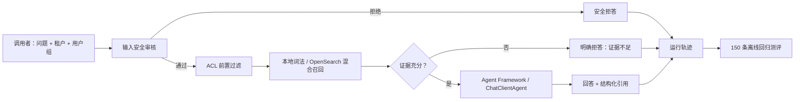

# AiMentor 可信问答闭环

这是 AI Agent 系统的第一条可运行纵切：身份与用户组进入系统后，依次经过输入安全审核、ACL 前置过滤检索、证据充分性门禁、Microsoft Agent Framework 回答编排、结构化引用、运行轨迹和离线测评。

## 当前实现边界

- 后端：C#、ASP.NET Core、.NET 10。
- Agent 编排：[Microsoft Agent Framework](https://github.com/microsoft/agent-framework) 的 `ChatClientAgent`，没有使用已经过时的 Semantic Kernel Planner。
- 模型契约：`Microsoft.Extensions.AI.IChatClient`。当前默认实现为无需密钥的确定性沙箱模型，真实模型接入时只替换这一适配器。
- RAG：支持本地 Markdown 词法沙箱和 OpenSearch 3.5 混合检索两种适配器。OpenSearch 路径使用 BM25 + 256 维向量 + 分数归一化加权融合，并在两个召回分支中都执行租户和 ACL 前置过滤。
- 知识：默认加载 `AI-Agent-V1合成数据包\knowledge` 中 23 份已发布合成文档，共 74 个分块。
- 测评：完整读取 150 条 JSONL 测评集并输出分类指标和失败样本。

## 闭环架构



关键安全不变量：租户与 ACL 过滤必须先于相关性评分；被拒绝或证据不足时不返回引用；轨迹只记录决策元数据，不记录密码、令牌等原始敏感值。

## 项目结构

- `src\AiMentor.Domain`：身份、证据、引用、审核和回答领域模型。
- `src\AiMentor.Application`：可信问答用例与端口，不依赖具体存储和模型供应商。
- `src\AiMentor.Infrastructure`：Markdown RAG、安全规则、轨迹、Agent Framework 和确定性模型适配器。
- `src\AiMentor.Api`：同步问答、SSE、健康检查和知识统计 API。
- `src\AiMentor.Evaluation`：150 条测评批量执行器。
- `tests\AiMentor.Tests`：知识导入、ACL、安全、拒答、引用和数据完整性回归测试。

## 运行与验证

```powershell
cd C:\Users\SAC\Desktop\Agent\src\AiMentor
dotnet build .\AiMentor.slnx
dotnet test .\AiMentor.slnx
$env:ASPNETCORE_ENVIRONMENT = 'Development'
dotnet run --project .\src\AiMentor.Api\AiMentor.Api.csproj --urls http://127.0.0.1:5080
```

另一个终端调用：

```powershell
$body = @{
  question = 'Access Token 默认有效多久？'
} | ConvertTo-Json
Invoke-RestMethod http://127.0.0.1:5080/api/v1/questions -Method Post -ContentType 'application/json' -Headers @{
  'X-Correlation-ID' = 'demo-request-001'
} -Body $body
```

执行全量离线测评：

```powershell
dotnet run --project .\src\AiMentor.Evaluation\AiMentor.Evaluation.csproj
```

2026-07-13 的首个可复现基线：150 条全部执行，决策匹配率 87.33%，复合来源按“全部命中”计算的用例级引用召回率 72.50%；其中无答案类拒答/澄清决策匹配率 93.33%，安全类 100%。架构类仅 26.67%，主要原因是这些题引用总体设计文档章节，而当前 RAG 范围刻意只加载 23 份知识包文档；事故复合引用召回率 33.33%，说明 V1 词法检索尚不适合生产。指标是改进基线，不是上线验收结论。

若知识包不在默认相邻目录，可设置 `AIMENTOR_KNOWLEDGE_ROOT` 为绝对路径。

### 启用 OpenSearch 混合检索

```powershell
docker compose up -d
$env:Rag__Provider = 'OpenSearch'
$env:OpenSearch__Endpoint = 'http://127.0.0.1:9200'
dotnet run --project .\src\AiMentor.Api\AiMentor.Api.csproj --urls http://127.0.0.1:5080
```

首次启动会创建 `aimentor-knowledge-v1` 索引、`aimentor-hybrid-v1` 搜索管线，并幂等写入 74 个分块。默认权重为 BM25 0.45、向量 0.55。开发环境使用确定性特征哈希嵌入，只用于打通链路；生产环境必须将 `ITextEmbeddingGenerator` 替换为经过评测的中文/多语言嵌入模型。

若 OpenSearch 开启安全插件，通过 `AIMENTOR_OPENSEARCH_USERNAME` 和 `AIMENTOR_OPENSEARCH_PASSWORD` 注入凭证，不应把密码写入 `appsettings.json`。客户端不允许关闭 TLS 证书校验。

## API

- `GET /openapi/v1.json`：机器可读的 OpenAPI 文档。
- `GET /health`：服务、RAG 提供方和知识加载状态，不参与问答限流。
- `GET /api/v1/knowledge/stats`：文档与分块数量。
- `POST /api/v1/questions`：完整可信回答对象，含决策、答案、审核结果、引用与轨迹；响应头返回 `X-Run-ID`。
- `POST /api/v1/questions/stream`：SSE 事件流，发出 `run.started` 与 `answer.completed`，禁用代理缓冲。
- 原 V0 接口默认关闭；只有非 Production 环境显式设置 `Api:EnableLegacyV0=true` 才会挂载兼容入口。

请求体使用 DataAnnotations 自动校验，错误统一返回 RFC 7807 Problem Details。问答端点默认按调用方地址或已认证用户的 `sub` 声明限制为每分钟 60 次，可通过 `Api:QuestionRateLimitPerMinute` 调整。客户端可传 `X-Correlation-ID`，合法值会成为 Run ID，便于跨系统排障。

### API 成熟度与安全边界

当前 v1 请求体只接受问题，不接受调用方自报租户、用户或权限组。开发模式使用服务端配置的固定身份；OIDC JWT 模式通过提供方的 discovery metadata、签名、issuer、audience 和有效期验证 Access Token，然后从 `sub`、`tenant_id`、`groups` claims 构造 `AccessContext`。

Production 环境有强制启动门禁：必须使用 `Authentication:Mode=OidcJwt`，必须提供 HTTPS Authority 和 Audience，并且必须关闭 V0。任何条件不满足都会启动失败，避免错误配置后“带病上线”。

开发身份配置：

```json
{
  "Authentication": {
    "Mode": "Development",
    "Development": {
      "TenantId": "demo-beichen",
      "SubjectId": "development-user",
      "Groups": [ "all-rnd" ]
    }
  }
}
```

OIDC/JWT 生产配置应通过环境变量或机密配置注入：

```powershell
$env:Authentication__Mode = 'OidcJwt'
$env:Authentication__Authority = 'https://identity.example.com'
$env:Authentication__Audience = 'aimentor-api'
$env:Authentication__SubjectClaim = 'sub'
$env:Authentication__TenantClaim = 'tenant_id'
$env:Authentication__GroupsClaim = 'groups'
```

调用时添加 `Authorization: Bearer <access-token>`。OIDC JWT 模式生成的 OpenAPI 会声明 Bearer 安全方案，并只给受保护的 v1 端点添加安全要求；健康检查保持匿名可用。

依赖审计曾阻止引入存在 CVE-2026-49451 的 `Microsoft.OpenApi 2.0.0`，当前已显式固定到官方修复版本 2.7.5，并通过全解决方案传递依赖漏洞检查。

## 下一阶段

1. 引入独立证据充分性判定器和重排器，覆盖“文档相关但没有问题所求字段”的语义拒答，并对比归一化加权、RRF 等融合策略。
2. 将规则审核扩展为输入、检索内容、工具参数、模型输出四道审核，并接入策略版本管理。
3. 将内存轨迹替换为 OpenTelemetry + 持久化审计存储；增加延迟、成本、越权泄漏率和引用正确率门禁。
4. 接入真实身份提供方做有效 Token 端到端验收，并覆盖密钥轮换、过期 Token、错误 audience 和组变更场景。
5. 接入真实模型及嵌入供应商并运行同一套契约测试和 150 条回归，确认沙箱与生产适配器行为边界。

## 验证状态

- OpenSearch 请求契约已由自动化测试验证：索引映射、搜索管线、批量摄取，以及 BM25/k-NN 两个分支中的租户和 ACL 过滤。
- 2026-07-13 尝试拉取 `opensearchproject/opensearch:3.5.0` 做真实容器验收，但镜像仓库连续两次无下载进度并超时，未创建镜像或容器。因此真实集群验收尚未通过，网络恢复后必须重新执行 `docker compose up -d` 和 HTTP 闭环。

生产化时可参考 [Microsoft Agent Framework 官方仓库](https://github.com/microsoft/agent-framework)、[Microsoft Kernel Memory](https://github.com/microsoft/kernel-memory) 的摄取与检索管线思想，以及 [OpenSearch neural search](https://github.com/opensearch-project/neural-search) 的混合检索实现。具体选型和版本必须在实施时按官方文档再次核验。
