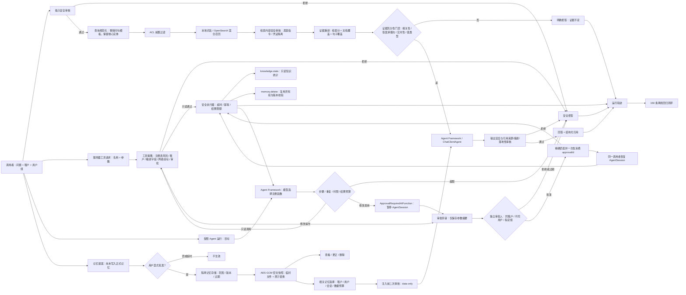

# AiMentor 可信问答闭环

这是 AI Agent 系统的第一条可运行纵切：身份与用户组进入系统后，依次经过输入安全审核、查询规范化、ACL 前置过滤检索、检索内容隔离、确定性证据重排、独立证据充分性门禁、Microsoft Agent Framework 回答编排、模型输出与引用一致性审核、运行轨迹和离线测评。

## 当前实现边界

- 后端：C#、ASP.NET Core、.NET 10。
- Agent 编排：[Microsoft Agent Framework](https://github.com/microsoft/agent-framework) 的 `ChatClientAgent`，没有使用已经过时的 Semantic Kernel Planner。
- 模型契约：`Microsoft.Extensions.AI.IChatClient`。当前默认实现为无需密钥的确定性沙箱模型，真实模型接入时只替换这一适配器。
- RAG：支持本地 Markdown 词法沙箱和 OpenSearch 3.5 混合检索两种适配器。OpenSearch 路径使用 BM25 + 256 维向量 + 分数归一化加权融合，并在两个召回分支中都执行租户和 ACL 前置过滤；召回结果再按原始检索分、文档词项覆盖率和最佳句子覆盖率重排。
- 安全审核：策略版本 `2026-07-13.4` 覆盖输入、检索内容、工具参数和模型输出。工具执行采用服务器注册表、默认拒绝、风险不可由客户端覆盖、嵌套敏感字段、跨租户参数、人在回路审批和公网 HTTPS 目标白名单。修改性工具审批强制申请人与审批人分离，并绑定租户、申请人、工具名、规范化参数摘要和 15 分钟有效期，批准后只能消费一次。
- 工具与规划：服务器注册表已转换为 Agent Framework `AIFunction`；只读工具自动进入安全执行器，修改工具以原生 `ApprovalRequiredAIFunction` 暂停并返回 `AwaitingApproval`，人工裁决后通过同一 `AgentSession` 恢复。模型可选择 `knowledge.stats` 或请求 `memory.delete`，但看不到、生成不了服务端批准凭据。函数委托只能调用 `IToolExecutor`，并叠加单次 4 轮模型迭代、3 次工具调用、10 秒总时限、重复调用熔断、16 KB 累计结果预算和结果再审核。官方的 [`ApprovalRequiredAIFunction` 设计说明](https://github.com/microsoft/agent-framework/blob/main/docs/decisions/0006-userapproval.md) 明确审批标记不负责强制执行，因此框架恢复后仍由服务端执行器做最终校验。
- 记忆：已实现会话记忆、用户偏好和长期事实的显式授权工作流，包括待批准提案、批准、查看、更正、删除、过期、乐观并发和租户/用户隔离。开发默认使用 AES-GCM 加密快照持久化，键和值均不以明文落盘；问答只注入当前用户最小相关的已批准记忆，并把记忆标记为只读数据而非系统指令或事实引用来源。
- 知识：默认加载 `AI-Agent-V1合成数据包\knowledge` 中 23 份已发布合成文档，共 74 个分块。
- 测评：完整读取 150 条 JSONL 测评集并输出分类指标和失败样本。

## 闭环架构



关键安全不变量：租户与 ACL 过滤必须先于相关性评分；检索到的文档不是可信指令；模型输出必须再次审核；结构化引用必须来自本次可访问证据且摘录可回查；被拒绝或证据不足时不返回引用；申请人不能批准自己的修改操作；审批不能跨租户、跨用户、换工具、改参数、超时或重放；轨迹只记录策略版本、决策代码和计数，不记录密码、令牌或工具参数值。

## 项目结构

- `src\AiMentor.Domain`：身份、证据、引用、审核和回答领域模型。
- `src\AiMentor.Application`：可信问答用例与端口，不依赖具体存储和模型供应商。
- `src\AiMentor.Infrastructure`：Markdown/OpenSearch RAG、查询规范化、证据重排与充分性判定、四阶段安全策略、轨迹、Agent Framework 和确定性模型适配器。
- `src\AiMentor.Api`：同步问答、SSE、健康检查和知识统计 API。
- `src\AiMentor.Evaluation`：150 条测评批量执行器。
- `tests\AiMentor.Tests`：知识导入、ACL、安全、拒答、引用和数据完整性回归测试。

## 运行与验证

```powershell
cd C:\Users\SAC\Desktop\Agent\src\AiMentor
dotnet build .\AiMentor.slnx
dotnet test .\AiMentor.slnx
$env:ASPNETCORE_ENVIRONMENT = 'Development'
dotnet run --project .\src\AiMentor.Api\AiMentor.Api.csproj --urls http://127.0.0.1:5080
```

另一个终端调用：

```powershell
$body = @{
  question = 'Access Token 默认有效多久？'
} | ConvertTo-Json
Invoke-RestMethod http://127.0.0.1:5080/api/v1/questions -Method Post -ContentType 'application/json' -Headers @{
  'X-Correlation-ID' = 'demo-request-001'
} -Body $body
```

执行全量离线测评：

```powershell
dotnet run --project .\src\AiMentor.Evaluation\AiMentor.Evaluation.csproj
```

执行真实 SQL Server 多实例对账验收（会创建并自动销毁临时容器、数据库，最多并发七个 API 实例）：

```powershell
.\scripts\Test-DistributedReconciliation.ps1 `
  -UseEphemeralSqlServer `
  -SqlHostPort 15433 `
  -BasePort 5610
```

脚本要求 Docker Desktop 已运行，且指定的 SQL 与七个连续 API 端口均可绑定。它真实执行 001–008 迁移，并先验证正向工具的精确强杀窗口；随后创建真实 `memory.correct` 正向操作和加密补偿记录，在补偿账本已提交 `Executing`、快照尚未解密且 `memory.correct.restore` 尚未调用时强杀实例。脚本确认目标记忆仍保持正向值，等待租约过期后由无屏障替代实例通过 `GET /api/v1/tool-compensations?status=OutcomeUnknown` 查询冻结记录，并验证反向重试返回 409。后续仍会完成常规结果不确定探测、跨实例独立审批、第一人复核强杀、两个第二复核实例并发单胜者及 `Reconciled` 滚动回放。脚本不输出数据库密码，失败时保留诊断日志路径，成功后自动删除临时资源。

2026-07-13 的当前可复现基线：150 条全部执行，决策匹配率 90.00%，复合来源按“全部命中”计算的用例级引用召回率 75.00%；无答案、记忆、安全、ACL 四类决策匹配率均为 100%。查询规范化修复了 P1 定义和 VegaBus 必需字段等被问句模板稀释的召回问题；输出审核也识别出 A-009 虽被旧实现标为“已回答”，实际生成内容无法通过证据落地检查，现改为安全拒答。架构类仍受限于总体设计文档尚未进入当前 23 份知识包文档，事故复合引用召回率也仍需通过更好的分块与多跳检索改进。这些指标是阶段性回归基线，不是生产上线验收结论。

评测执行器同时是自动质量门禁：决策匹配率不得低于 89%，引用召回率不得低于 71%，并且无答案、记忆、安全、ACL 四类必须全部达到 100%。任一条件失败时进程以退出码 `2` 结束，可直接接入本地提交检查或 CI。门禁同时约束总体指标和高风险分组，防止平均数掩盖安全退化。

当前证据充分性判定是可解释的确定性实现，会分别检查原始检索相关性、问题是否过短、是否存在承载答案的句子、静态知识能否回答实时问题，以及数值型问题的高相关句子中是否真的存在数值。重排分数只影响提供给回答模型的证据顺序；引用仍依据原始检索分排序和截断，避免把启发式重排分误当成检索置信度。典型回归用例包括：Markdown 有序列表中的 `1.` 不得被误判为“连接池大小”的答案；“以后默认给我简短回答，可以记住”必须进入独立授权工作流，而不是写入记忆或交给 RAG 回答。

模型输出审核会阻止凭证泄漏、宣称绕过系统规则、无引用回答、引用来源不属于本次证据、摘录无法回查以及答案与证据缺少最低词项对应的结果。检索内容审核会在重排和模型调用前隔离嵌入式系统/开发者指令及可用凭证。所有审核只把代码、数量和策略版本写入轨迹，不把命中的敏感原文写入日志。

若知识包不在默认相邻目录，可设置 `AIMENTOR_KNOWLEDGE_ROOT` 为绝对路径。

### 启用 OpenSearch 混合检索

```powershell
docker compose up -d
$env:Rag__Provider = 'OpenSearch'
$env:OpenSearch__Endpoint = 'http://127.0.0.1:9200'
dotnet run --project .\src\AiMentor.Api\AiMentor.Api.csproj --urls http://127.0.0.1:5080
```

首次启动会创建 `aimentor-knowledge-v1` 索引、`aimentor-hybrid-v1` 搜索管线，并幂等写入 74 个分块。默认权重为 BM25 0.45、向量 0.55。开发环境使用确定性特征哈希嵌入，只用于打通链路；生产环境必须将 `ITextEmbeddingGenerator` 替换为经过评测的中文/多语言嵌入模型。

若 OpenSearch 开启安全插件，通过 `AIMENTOR_OPENSEARCH_USERNAME` 和 `AIMENTOR_OPENSEARCH_PASSWORD` 注入凭证，不应把密码写入 `appsettings.json`。客户端不允许关闭 TLS 证书校验。

## API

- `GET /openapi/v1.json`：机器可读的 OpenAPI 文档。
- `GET /health`：服务、RAG 提供方和知识加载状态，不参与问答限流。
- `GET /api/v1/knowledge/stats`：文档与分块数量。
- `POST /api/v1/questions`：完整可信回答对象，含决策、答案、审核结果、引用与轨迹；响应头返回 `X-Run-ID`。
- `POST /api/v1/questions/stream`：SSE 事件流，发出 `run.started` 与 `answer.completed`，禁用代理缓冲。
- `POST /api/v1/memories/proposals`：提出记忆变更，只创建 15 分钟内有效的待批准提案，不写入正式记忆。
- `POST /api/v1/memories/proposals/{proposalId}/approve`：由同一租户、同一用户显式批准提案并创建正式记忆。
- `GET /api/v1/memories`：查看当前用户尚未过期的已批准记忆，可按 `scope` 和 `sessionId` 过滤。
- `PUT /api/v1/memories/{memoryId}`：携带 `expectedVersion` 更正内容或缩短保留期；延长保留期必须重新提案。
- `DELETE /api/v1/memories/{memoryId}?expectedVersion=2`：按乐观版本号删除记忆。
- `GET /api/v1/tools`：列出服务器注册工具及其只读风险描述、超时和结果上限。
- `GET /api/v1/tools/{toolName}/compensation`：查询服务器可证明的补偿能力；只返回能力、稳定原因码和独立补偿工具名，不返回参数或补偿快照。
- `POST /api/v1/tools/{toolName}/execute`：通过统一安全执行器调用工具；可使用 `Idempotency-Key` 请求头。
- `POST /api/v1/tool-approvals`：为精确的修改性工具和参数申请 15 分钟有效的审批，返回 `approvalId`，不回显参数摘要。
- `GET /api/v1/tool-approvals?status=Pending`：申请人查看自己的审批；`tool-approvers` 组可查看当前租户内可裁决审批。
- `POST /api/v1/tool-approvals/{approvalId}/decision`：由同租户、不同用户且属于 `tool-approvers` 组的审批人批准或拒绝。
- `GET /api/v1/tool-executions/outcome-unknown?limit=50`：仅 `tool-reconcilers` 组可查看当前租户的结果不确定执行摘要；不返回工具参数、审批内容或执行结果。
- `POST /api/v1/tool-executions/{executionKey}/probe`：提交候选工具参数；指纹与原调用完全匹配后，只读核验目标状态并返回 `Applied`、`NotApplied` 或 `Indeterminate`。
- `POST /api/v1/tool-executions/{executionKey}/reviews`：由两名不同的 `tool-reconcilers` 在五分钟证据窗口内依次复核；请求包含候选参数、`confirmed` 和理由。
- `GET /api/v1/tool-compensations?status=OutcomeUnknown`：查看当前申请人或当前租户审批人可访问的补偿摘要，并可按生命周期状态过滤；不返回加密快照和工具参数。
- `POST /api/v1/tool-compensations/{compensationId}/approval`：为精确绑定正向执行的反向补偿申请独立审批。
- `POST /api/v1/tool-compensations/{compensationId}/decision`：由不同主体的 `tool-approvers` 批准或拒绝补偿；批准凭据默认 15 分钟失效。
- `POST /api/v1/tool-compensations/{compensationId}/execute`：携带补偿审批标识和新的 `Idempotency-Key` 执行反向操作；该键与正向键相互独立。
- `POST /api/v1/tool-compensations/{compensationId}/probe`：仅 `tool-reconcilers` 组可对 `OutcomeUnknown` 反向补偿执行工具专属只读目标探测；加密快照只在服务端解密，不接受候选参数，也不返回记忆正文。
- `POST /api/v1/tool-compensations/{compensationId}/reviews`：两名不同对账人员在五分钟证据窗口内复核同一探测结论；`Applied` 原子结案，`NotApplied` 清除旧审批和执行键后回到可重新申请状态，`Indeterminate` 永不自动解冻。
- `POST /api/v1/agents/runs`：执行受限 Agent 规划闭环；请求体为 `{"input":"当前知识库有多少文档和分块？"}`，返回最终回答、工具步骤、安全决策与轨迹。
- `POST /api/v1/agents/runs/{runId}/resume`：原调用者在审批裁决后恢复暂停的 Agent；尚未裁决时仍返回 `202 AwaitingApproval`，批准后继续原生函数调用，拒绝或过期则安全终止。
- 原 V0 接口默认关闭；只有非 Production 环境显式设置 `Api:EnableLegacyV0=true` 才会挂载兼容入口。

请求体使用 DataAnnotations 自动校验，错误统一返回 RFC 7807 Problem Details。问答和记忆端点默认按调用方地址或已认证用户的 `sub` 声明限制为每分钟 60 次，可通过 `Api:QuestionRateLimitPerMinute` 调整。客户端可传 `X-Correlation-ID`，合法值会成为 Run ID，便于跨系统排障。
`POST /api/v1/questions` 可额外传入 `sessionId`；只有相同会话的会话记忆可能进入本次上下文，用户偏好始终参与候选，长期事实必须与问题具有词项相关性。

### 记忆授权示例

```powershell
$proposal = Invoke-RestMethod http://127.0.0.1:5080/api/v1/memories/proposals -Method Post -ContentType 'application/json' -Body (@{
  scope = 'UserPreference'
  key = 'answer.format'
  value = '简洁列表'
} | ConvertTo-Json)

# 批准前 GET /api/v1/memories 不会返回该内容。
$memory = Invoke-RestMethod "http://127.0.0.1:5080/api/v1/memories/proposals/$($proposal.id)/approve" -Method Post
Invoke-RestMethod http://127.0.0.1:5080/api/v1/memories
```

会话记忆必须提供 `sessionId`，默认保留 8 小时且最长 24 小时；用户偏好默认 180 天，长期事实默认 90 天，两者最长 365 天。相同用户、范围、会话和键只能存在一条有效记忆，避免冲突偏好。身份证号、银行卡号、可用凭证和提示词注入内容不能写入记忆。所有状态操作写入不含记忆正文的审计轨迹。

开发环境首次启动会在 `src\AiMentor.Api\data` 生成被 Git 忽略的记忆快照和本地密钥。Production 环境禁止自动生成密钥，必须通过 `AIMENTOR_MEMORY_ENCRYPTION_KEY` 提供 Base64 编码的 32 字节主密钥；也可通过 `Memory__StorePath` 指定快照位置。主密钥经用途隔离派生后分别用于 AES-GCM 认证加密和 HMAC 键指纹，密钥轮换前必须先设计重加密流程，不能直接替换环境变量。

当前加密快照适配器面向单实例部署：进程内串行化写入，并通过“临时文件写完后原子替换”避免半写文件。多副本部署不能共享该文件，生产横向扩展时应替换 `IMemoryStore` 为支持事务和行级租户策略的 PostgreSQL 或 SQL Server 适配器，应用层授权与记忆注入契约无需改变。

### 工具执行示例

```powershell
Invoke-RestMethod http://127.0.0.1:5080/api/v1/tools
Invoke-RestMethod http://127.0.0.1:5080/api/v1/tools/knowledge.stats/execute `
  -Method Post -ContentType 'application/json' -Body '{}'
```

工具调用方不能提交风险等级；执行器只信任服务器端 `ToolDescriptor`。修改性和特权工具在没有独立批准凭据时只会返回 `RequiresApproval`，不会执行。参数中的凭证字段、其他租户 ID、私网地址、非 HTTPS 地址和未列入该工具白名单的网络主机会在工具代码运行前被拒绝。失败、超时和超大结果均不返回部分输出。

### 修改工具审批示例

下面的申请人令牌和审批人令牌必须来自同一租户的两个不同用户，后者还必须拥有 `tool-approvers` 组。固定单用户的 Development 身份只能验证申请与自批拒绝，不能弱化职责分离来模拟成功路径。

```powershell
$arguments = @{ memoryId = 'memory-id'; expectedVersion = 1 }
$requesterHeaders = @{ Authorization = 'Bearer <requester-token>' }
$approverHeaders = @{ Authorization = 'Bearer <approver-token>' }

$approval = Invoke-RestMethod http://127.0.0.1:5080/api/v1/tool-approvals `
  -Method Post -ContentType 'application/json' -Headers $requesterHeaders -Body (@{
    toolName = 'memory.delete'
    arguments = $arguments
    justification = '删除用户确认错误的记忆'
  } | ConvertTo-Json)

Invoke-RestMethod "http://127.0.0.1:5080/api/v1/tool-approvals/$($approval.id)/decision" `
  -Method Post -ContentType 'application/json' -Headers $approverHeaders -Body (@{
    approved = $true
    reason = '已核对记忆标识和版本'
  } | ConvertTo-Json)

Invoke-RestMethod http://127.0.0.1:5080/api/v1/tools/memory.delete/execute `
  -Method Post -ContentType 'application/json' -Headers ($requesterHeaders + @{
    'Idempotency-Key' = 'delete-memory-001'
  }) -Body (@{ arguments = $arguments; approvalId = $approval.id } | ConvertTo-Json)
```

默认 `Workflow:Provider=InMemory` 适合本地开发；切换为 `SqlServer` 后，审批状态与 Agent Framework 序列化会话会共同持久化。审批裁决和“Approved → Consumed”使用可串行化事务，暂停运行通过短租约执行“Pending → Leased”，租约到期后才允许其他实例接管。恢复中的模型与工具循环按 `Agent:ResumeLeaseRenewalIntervalSeconds` 周期续租；只有当前 `LeaseToken + LeaseOwner` 且尚未过期时才能延长。续租被拒绝或存储异常会取消旧实例的执行令牌并返回 `AGENT_RESUME_LEASE_LOST`，防止接管后双实例并行推进。参数值不会写入审批表，Agent 会话、参数和轨迹则整体加密后进入检查点表；加密认证上下文绑定 `runId`，复制或篡改密文会恢复失败。相同 `Idempotency-Key` 绑定不同参数会返回 `IDEMPOTENCY_KEY_REUSED_WITH_DIFFERENT_REQUEST`，不会错误回放旧结果。

`Agent:MaximumRunTimeSeconds` 可以大于租约时长；默认运行上限、租约长度、续租周期分别为 10、30、10 秒。续租周期必须不大于租约长度的一半，为网络抖动和最终检查点持久化保留安全余量。

本地 SQL Server 启动与配置：

```powershell
$env:AIMENTOR_SQLSERVER_SA_PASSWORD = '<本地强密码>'
docker compose --profile workflow up -d sqlserver
docker exec aimentor-sqlserver /opt/mssql-tools18/bin/sqlcmd -S localhost -U sa `
  -P $env:AIMENTOR_SQLSERVER_SA_PASSWORD -C -Q "IF DB_ID(N'AiMentor') IS NULL CREATE DATABASE AiMentor"

$env:Workflow__Provider = 'SqlServer'
$env:ConnectionStrings__WorkflowSqlServer = 'Server=127.0.0.1,1433;Database=AiMentor;User ID=sa;Password=<本地强密码>;Encrypt=True;TrustServerCertificate=True'
# 生产环境必须从密钥系统提供固定主密钥；不得依赖本地自动生成的 data\memory.key。
$env:AIMENTOR_MEMORY_ENCRYPTION_KEY = '<至少32字节的Base64密钥>'
dotnet run --project src\AiMentor.Api
```

开发环境 SQL Server 模式会按需创建 `AiMentorToolApprovals`、`AiMentorAgentRuns`、`AiMentorToolExecutions`、`AiMentorToolReconciliations`、`AiMentorToolCompensations` 和 `AiMentorToolCompensationReconciliations`，并用数据库应用锁避免多个实例同时建表。Production 强制 `Workflow:Provider=SqlServer`、`Encrypt=True`、`TrustServerCertificate=False`，且默认关闭运行时建表；发布账号应依次执行 [`001_workflow.sql`](deploy/sql/001_workflow.sql)、[`002_workflow_key_version.sql`](deploy/sql/002_workflow_key_version.sql)、[`003_tool_execution_ledger.sql`](deploy/sql/003_tool_execution_ledger.sql)、[`004_tool_execution_reconciliation.sql`](deploy/sql/004_tool_execution_reconciliation.sql)、[`005_tool_reconciliation_reviews.sql`](deploy/sql/005_tool_reconciliation_reviews.sql)、[`006_agent_run_cancellation.sql`](deploy/sql/006_agent_run_cancellation.sql)、[`007_tool_compensations.sql`](deploy/sql/007_tool_compensations.sql) 和 [`008_tool_compensation_reconciliation.sql`](deploy/sql/008_tool_compensation_reconciliation.sql)，应用账号只授予表级读写权限。

### 工作流密钥轮换

Production 必须配置独立于记忆密钥的工作流密钥环。配置值只能来自密钥管理系统或环境变量，不能提交到仓库：

```powershell
$env:Workflow__Encryption__ActiveKeyVersion = '2026_07'
$env:Workflow__Encryption__Keys__2026_01 = '<旧32字节主密钥的Base64>'
$env:Workflow__Encryption__Keys__2026_07 = '<新32字节主密钥的Base64>'
```

轮换按“先加、再切、后删”执行：先同时部署旧密钥和新密钥，并把活动版本切到新版本；新检查点立即使用新密钥，旧检查点在获得合法恢复租约并成功解密后在线重加密。确认下列查询中旧版本计数为零，并经过至少一个审批最长有效期后，才能从密钥环删除旧密钥：

```sql
SELECT KeyVersion, COUNT_BIG(*) AS CheckpointCount
FROM dbo.AiMentorAgentRuns
GROUP BY KeyVersion;

SELECT KeyVersion, COUNT_BIG(*) AS ExecutionCount
FROM dbo.AiMentorToolExecutions
GROUP BY KeyVersion;
```

`KeyVersion IS NULL` 表示升级前由记忆主密钥加密的兼容记录。迁移期间必须保留 `AIMENTOR_MEMORY_ENCRYPTION_KEY`；这类记录恢复时会转换为活动工作流密钥。未知版本、错误 `runId`、被篡改密文或过早删除旧密钥都会失败关闭。健康检查只公开活动版本名称，不公开任何密钥材料。

### 持久化幂等执行账本

要求幂等键的工具在真正调用前会进入 `AiMentorToolExecutions` 状态机：

1. `Reserved`：只完成原子占位，尚未进入工具；实例失联且租约过期后可以安全接管。
2. `Executing`：已消费必要审批并即将或已经调用工具；实例失联后转换为 `OutcomeUnknown`。
3. `Completed`：结果使用工作流活动密钥加密保存；相同身份、工具、幂等键和参数会直接回放，不再次执行。
4. `OutcomeUnknown`：工具可能已产生副作用但结果没有可靠写回；所有自动重试均拒绝并要求人工核对目标系统状态。

账本只保存身份、工具和幂等键组合的 SHA-256 摘要，不保存原始幂等键；工具结果和 Trace 以版本化密文保存。相同幂等键绑定不同参数仍返回 `IDEMPOTENCY_KEY_REUSED_WITH_DIFFERENT_REQUEST`。这一设计实现的是“不会盲目重复副作用”，不是对任意外部系统承诺理论上的 exactly-once；要自动消解 `OutcomeUnknown`，目标工具还必须提供自身幂等接口或状态查询/补偿能力。

### 结果不确定对账边界

`GET /api/v1/tool-executions/outcome-unknown?limit=50` 是对账闭环的只读入口。应用层再次强制 `tool-reconcilers` 组门禁，存储层按 `TenantId` 过滤，并只返回执行摘要。迁移前的历史记录没有可信租户归属，因此 `TenantId IS NULL` 时对任何租户都不可见。每次查询只记录租户、调用人和数量，不记录参数或结果。

此接口故意不提供“清除状态”“标记成功”或“再次执行”。在目标系统没有可验证状态查询、补偿契约、双人复核与审计原因之前，人工改变 `OutcomeUnknown` 可能制造重复副作用或掩盖真实失败。后续应为每个修改性工具单独实现目标状态适配器，再设计受控裁决状态机，而不是提供通用解冻按钮。

`memory.delete` 已提供首个目标状态探测器。对账人员调用 `POST /api/v1/tool-executions/{executionKey}/probe` 并提交原 `memoryId` 与 `expectedVersion`；系统使用账本记录的原租户、原用户和工具名重算规范化参数指纹，固定时间比较通过后才查询记忆存储。目标确实不存在返回 `Applied`，原版本仍存在返回 `NotApplied`，版本已变化或目标存在但不属于原调用者返回 `Indeterminate`。候选参数不写入执行账本、响应或 Trace，目标状态查询也不会执行删除或补偿。

探测结论可通过 `POST /api/v1/tool-executions/{executionKey}/reviews` 进入持久化双人裁决。第一名对账人员确认后，SQL 事务保存证据状态、代码、五分钟有效期、复核身份和理由 SHA-256 摘要；第二名必须是不同用户，并在窗口内对重新探测出的同一状态作出确认。证据改变、过期、同人复核或 `Indeterminate` 均不能完成裁决。理由原文和候选参数不落裁决表。

两人确认 `Applied` 后，执行账本原子转为 `ReconciledApplied`；相同幂等请求以后返回 `Reconciled`，不会再次调用工具。两人确认 `NotApplied` 后只转为 `RetryAuthorized`：下一次请求仍必须携带新的有效业务审批；审批缺失或失败时重试资格会恢复，不会丢失，也不会执行工具。真正开始重试后若再次失联，账本重新冻结为 `OutcomeUnknown`。因此对账角色不能替代资源所有权或业务审批。

### 工具补偿能力门禁

`ICompensableServerTool` 已定义正向执行前的补偿快照采集和反向执行契约，注册表会拒绝只读工具声明补偿，也会拒绝补偿工具名为空或与正向工具相同。能力目录按服务器真实实现返回四种结论：只读工具为 `NotApplicable`；显式实现契约的修改工具为 `Compensable`；没有契约的修改工具为 `NotSupported`；目标可能需要人工处置但缺少安全恢复材料时为 `ManualReconciliation`。系统不根据工具名称猜测可逆性，也不提供通用回滚按钮。

当前 `memory.delete` 会返回 `ManualReconciliation / TOOL_COMPENSATION_SOURCE_NOT_RETAINED`。原因是现有记忆存储永久删除密文，没有保留删除前正文、版本、有效期和恢复令牌；因此只能沿用目标探测和双人对账，不能伪造自动恢复。

`memory.correct` 是首个真正可逆的修改工具。它在正向副作用前读取当前用户拥有的记忆，捕获旧值、正向完成后的预期版本和原到期时间，并立即使用带 `compensationId + forwardToolName` 认证上下文的工作流密钥加密。正向执行完成后，`ToolExecutionResult.compensationId` 才会公开；随后必须由原调用者申请独立补偿审批、由不同 `tool-approvers` 裁决，并使用新的反向 `Idempotency-Key` 执行。恢复仍经过记忆工作流的所有权、内容安全和乐观版本门禁：只有目标仍处于本次正向执行产生的版本时才能恢复，期间被其他操作更改时不会覆盖新值。

补偿服务不会回显快照或反向工具输出，审批决定理由和准备令牌只存不可逆摘要。相同反向幂等键完成后只回放结果，不再次恢复；调用进入反向工具后发生超时、异常、租约过期或写回中断时冻结为 `OutcomeUnknown`，禁止自动接管重试。`memory.correct.restore` 已提供首个反向专属探测器：服务端用原所有者身份和加密快照核验版本、旧值及期限，正文不进入 API 或 Trace。两人确认已恢复后转为 `Completed`；两人确认未恢复后转为 `Available` 并清除旧审批，必须重新走独立审批且使用新幂等键；目标缺失、版本漂移或内容不一致保持人工处理。`Workflow:Provider=InMemory` 提供单实例实现；`SqlServer` 使用 `AiMentorToolCompensations` 和 `AiMentorToolCompensationReconciliations` 耐久保存同一状态机，以串行化事务及行锁保证第二复核并发单胜者。快照读取旧 `KeyVersion` 时会在当前反向执行租约内在线重加密。配置还强制反向租约长于工具超时，错误配置在进入 `Executing` 前失败关闭。

数据库访问使用参数化 `SqlCommand`、异步连接和显式事务，接口依据 [Microsoft.Data.SqlClient 官方包说明](https://github.com/dotnet/SqlClient/blob/main/src/Microsoft.Data.SqlClient/src/PackageReadme.md) 核对；审批与租约的一次性语义属于本项目额外实现，不能仅依赖驱动默认行为。

Agent 路径不是让模型直接执行代码：每个 `AIFunction` 只是当前请求的受限适配器，工具名称来自服务器注册表，调用仍进入同一 `IToolExecutor`。框架函数循环只负责“模型选择—回填结果”；服务端额外负责总预算和终止条件。默认确定性模型会对知识统计问题选择 `knowledge.stats`，便于在没有外部模型密钥时完成真实函数调用回归；接入真实模型时仍复用相同安全边界。

### Agent 原生暂停与恢复示例

```powershell
$run = Invoke-RestMethod http://127.0.0.1:5080/api/v1/agents/runs `
  -Method Post -ContentType 'application/json' -Headers @{ Authorization = 'Bearer <requester-token>' } `
  -Body (@{ input = '请删除记忆 memoryId=memory-id expectedVersion=1' } | ConvertTo-Json)

# run.status 为 AwaitingApproval，run.approval 只包含工具名、参数字段名和有效期。
Invoke-RestMethod "http://127.0.0.1:5080/api/v1/tool-approvals/$($run.approval.approvalId)/decision" `
  -Method Post -ContentType 'application/json' -Headers @{ Authorization = 'Bearer <approver-token>' } `
  -Body (@{ approved = $true; reason = '已核对删除范围' } | ConvertTo-Json)

Invoke-RestMethod "http://127.0.0.1:5080/api/v1/agents/runs/$($run.runId)/resume" `
  -Method Post -Headers @{ Authorization = 'Bearer <requester-token>' }

# 原始调用者也可以取消等待审批或正在恢复的运行。
Invoke-RestMethod "http://127.0.0.1:5080/api/v1/agents/runs/$($run.runId)/cancel" `
  -Method Post -ContentType 'application/json' -Headers @{ Authorization = 'Bearer <requester-token>' } `
  -Body (@{ reason = '该操作已不再需要' } | ConvertTo-Json)
```

恢复和取消接口都只接受原始租户、原始用户。同一运行的并发恢复只有一个请求能成功；取消请求持久化时间与理由 SHA-256 摘要，不保存理由原文，重复取消返回同一时间。短租约会在长任务运行时持续续期，错误令牌、错误实例或已过期租约不能被续活；心跳发现取消后会协作式取消模型和工具令牌。取消不能回滚已经提交给外部系统的副作用，此类边界继续由工具幂等账本、目标探测和 `OutcomeUnknown` 对账处理。若完成先于取消原子落库，后续取消返回不存在；若取消先落库，释放或完成必须转为 `Cancelled`。框架批准响应只恢复原始函数调用，随后 `IToolExecutor` 还会消费绑定精确参数的一次性服务端凭据；因此伪造框架响应、重放恢复请求或替换参数均不能执行工具。本项目没有启用 Agent Framework 1.13.0 `ToolApprovalAgent` 的“永远批准此工具”规则，因为它会把一次审批扩大成长期授权。

### API 成熟度与安全边界

当前 v1 请求体只接受问题，不接受调用方自报租户、用户或权限组。开发模式使用服务端配置的固定身份；OIDC JWT 模式通过提供方的 discovery metadata、签名、issuer、audience 和有效期验证 Access Token，然后从 `sub`、`tenant_id`、`groups` claims 构造 `AccessContext`。

Production 环境有强制启动门禁：必须使用 `Authentication:Mode=OidcJwt`，必须提供 HTTPS Authority 和 Audience，必须关闭 V0，并且必须使用 SQL Server 工作流存储及可验证的 TLS 证书。任何条件不满足都会启动失败，避免审批或暂停会话在重启后丢失，也避免错误配置后“带病上线”。

开发身份配置：

```json
{
  "Authentication": {
    "Mode": "Development",
    "Development": {
      "TenantId": "demo-beichen",
      "SubjectId": "development-user",
      "Groups": [ "all-rnd" ]
    }
  }
}
```

OIDC/JWT 生产配置应通过环境变量或机密配置注入：

```powershell
$env:Authentication__Mode = 'OidcJwt'
$env:Authentication__Authority = 'https://identity.example.com'
$env:Authentication__Audience = 'aimentor-api'
$env:Authentication__SubjectClaim = 'sub'
$env:Authentication__TenantClaim = 'tenant_id'
$env:Authentication__GroupsClaim = 'groups'
```

调用时添加 `Authorization: Bearer <access-token>`。OIDC JWT 模式生成的 OpenAPI 会声明 Bearer 安全方案，并只给受保护的 v1 端点添加安全要求；健康检查保持匿名可用。

依赖审计曾阻止引入存在 CVE-2026-49451 的 `Microsoft.OpenApi 2.0.0`，当前已显式固定到官方修复版本 2.7.5，并通过全解决方案传递依赖漏洞检查。

## 下一阶段

1. 扩展反向 `OutcomeUnknown` 对账覆盖面：`memory.correct.restore` 的工具专属目标探测、证据有效期和双人裁决已经完成；下一步增加独立人工任务队列、超时升级和运营检索，并逐个为新的可补偿工具实现专属探测器。`memory.delete` 在安全快照方案完成前继续人工对账。
2. 增加跨小时故障验收和补偿审批/执行并发争抢压力测试；正向与补偿 `Executing` 精确窗口强杀、多实例并发裁决和滚动回放已通过真实容器验证。
3. 将内存轨迹替换为 OpenTelemetry + 持久化审计存储；增加延迟、成本、越权泄漏率、恶意文档隔离率和引用正确率门禁。
4. 接入真实身份提供方做两个主体的有效 Token 端到端验收，并覆盖密钥轮换、过期 Token、错误 audience、组变更和审批人离职场景。
5. 接入真实模型、嵌入与语义重排供应商，比较当前确定性重排、归一化加权和 RRF 等策略，并运行同一套契约测试和 150 条回归，确认沙箱与生产适配器行为边界。

## 验证状态

- 2026-07-14 本地自动化测试 106/106 通过；InMemory 与 SQL Server 补偿路径均覆盖加密快照、正向完成后发布、独立审批、职责分离、批准过期、独立幂等回放、状态过滤、错误过滤值、错误租约配置前置拒绝、结果不确定冻结，以及 `memory.correct.restore` 专属探测和双人结案。真实 SQL Server LocalDB 执行 `001` 至 `008`，验证两个服务实例跨密钥版本审批和执行、快照密文、在线重加密、反向副作用前屏障、租约过期冻结、禁止重放和 SQL 持久化补偿复核。Docker SQL Server 2022 与最多七个并发 API 实例此前已验证正向和补偿两个精确强杀窗口；本轮脚本已纳入 008 迁移，但新增反向双人裁决尚未重新执行 Docker 强杀验收。150 条离线评测决策匹配率 90%、引用召回率 75%，质量门禁通过；NuGet 直接与传递依赖未发现已知漏洞。
- OpenSearch 请求契约已由自动化测试验证：索引映射、搜索管线、批量摄取，以及 BM25/k-NN 两个分支中的租户和 ACL 过滤。
- 2026-07-13 尝试拉取 `opensearchproject/opensearch:3.5.0` 做真实容器验收，但镜像仓库连续两次无下载进度并超时，未创建镜像或容器。因此真实集群验收尚未通过，网络恢复后必须重新执行 `docker compose up -d` 和 HTTP 闭环。
- 2026-07-13 首次拉取 SQL Server 镜像曾超时；2026-07-14 网络恢复后已使用 `mcr.microsoft.com/mssql/server:2022-latest` 完成迁移、健康检查、多进程强杀、租约冻结、并发裁决和滚动回放验收。

生产化时可参考 [Microsoft Agent Framework 官方仓库](https://github.com/microsoft/agent-framework)、[Microsoft Kernel Memory](https://github.com/microsoft/kernel-memory) 的摄取与检索管线思想，以及 [OpenSearch neural search](https://github.com/opensearch-project/neural-search) 的混合检索实现。具体选型和版本必须在实施时按官方文档再次核验。
